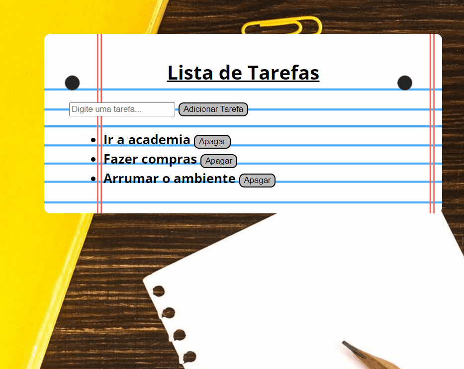

## Lista de Tarefas em JavaScript

<h3>✍️Objetivo</h3>

O objetivo desse projeto foi reunir o conhecimento obtido até o momento, colocando em prática funções, DOM, arrays e manipulação de eventos. Também foi inserido local storage com a finalidade de preservar as tarefas dispostas pelo usuário ao fechar o navegador.

🔗[Clique aqui para acessar](https://pedrodevvv.github.io/To-Do-List-JS/)
## 🛠️Tecnologias

* JavaScript
* HTML
* CSS
* Visual Studio Code

## 📞 Contato

📩E-mail: pedrohgs2004@gmail.com  
🌐Linkedin: https://www.linkedin.com/in/pedro-henrique-g-silva-a2100a23a/?originalSubdomain=br
